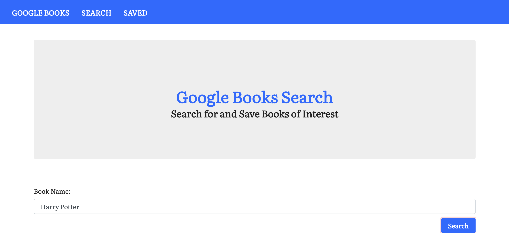
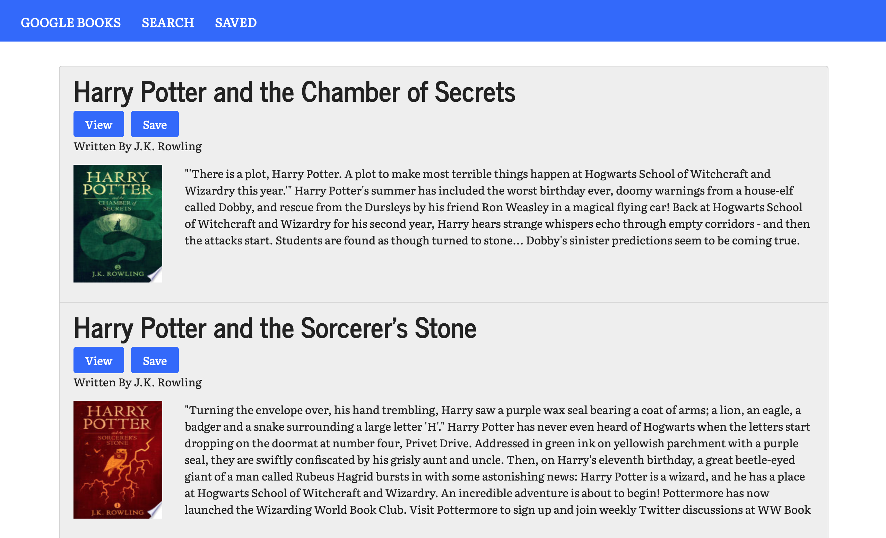

# React Google Books Search

This is a full-stack, React-based Google Books Search app that allows users to search for books based on Google Books API and save books for later review. The app has two routes -- search route  and save route. Click on the icons on the navbar to go to different pages. 

## Role

Independent Full-stack Web Developer

## Technologies Used

- React.js
- Node.js
- MongoDB
- Mongoose 
- Google Books API & AJAX calls
- Router 

## How to Use?

The app has two routes -- one is search and the other is saved. On the search page, it has a search box that you can put in any book name and click on the search button. It would show all the search results related to the book. 

In the search results, it has a view button and a saved button. Click on view to view the book's information. Click on `Save` to save the book for further reading. Go to saved page to view all the saved books. You can do delete and view book information there. 

## Deployed Link

https://fathomless-journey-18044.herokuapp.com/

## Contact Information 
General Inquiries at ddzhang2018@gmail.com. 